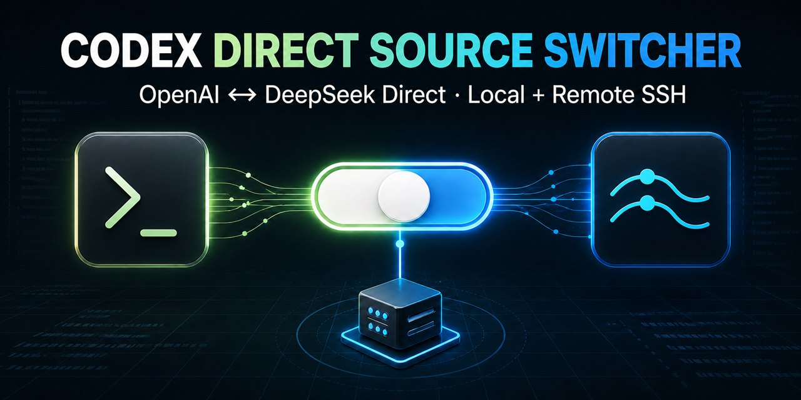

# Codex DeepSeek Switcher

[](https://github.com/dzrdzrdzr/codex-model-switcher/actions/workflows/ci.yml)
[](https://github.com/dzrdzrdzr/codex-model-switcher/releases/latest)
[](LICENSE)
[](#supported-environments)

**Switch VS Code Codex between OpenAI and DeepSeek's native Responses API without sharing credentials or configuration between local and Remote SSH environments.**

[Download the latest VSIX](https://github.com/dzrdzrdzr/codex-model-switcher/releases/latest) · [中文说明](docs/README.zh-CN.md) · [Troubleshooting](docs/TROUBLESHOOTING.md) · [Report a bug](https://github.com/dzrdzrdzr/codex-model-switcher/issues/new?template=bug_report.yml)



## Why this exists

DeepSeek's official Codex setup is convenient for one environment, but it changes the shared Codex home. That becomes fragile when Codex Desktop, local VS Code, and Remote SSH windows need different providers.

This extension keeps the profiles separate:

```text
Codex Desktop  ──> OpenAI profile
Local VS Code  ──> OpenAI or DeepSeek Direct
Remote SSH     ──> OpenAI or DeepSeek Direct, independently per host
```

DeepSeek mode connects directly to:

```toml
base_url = "https://api.deepseek.com/"
wire_api = "responses"
```

No MoonBridge, localhost relay, protocol disguise, or shared API-key file is required.

## What it does

- Switches the current VS Code environment between **GPT (OpenAI)** and **DeepSeek Direct**.
- Keeps local VS Code and every Remote SSH extension host independently configurable.
- Creates an isolated DeepSeek Codex home instead of overwriting the normal OpenAI profile.
- Supports `deepseek-v4-pro` and `deepseek-v4-flash`.
- Detects and avoids older relay wrappers when the real Codex binary is available.
- Shows the active provider, model, endpoint, wire API, and Codex version without printing the API key.
- Preserves legacy command IDs so upgrades from earlier builds remain usable.

## Installation

### Local VS Code

1. Download the `.vsix` file from the [latest release](https://github.com/dzrdzrdzr/codex-model-switcher/releases/latest).
2. Install it:

```powershell
code --install-extension .\codex-direct-model-switcher-0.2.7.vsix --force
```

The filename changes with each release; use the file you downloaded.

### Remote SSH

Install the VSIX on the remote extension host, not only in the local VS Code window:

```powershell
code --remote ssh-remote+your-host `
  --install-extension .\codex-direct-model-switcher-0.2.7.vsix `
  --force
```

Alternatively, connect to the host, open **Extensions: Install from VSIX...**, and confirm the extension is installed under **SSH: your-host**.

## Quick start

Open the command palette and run:

```text
Codex Source: Switch GPT / DeepSeek Direct
```

The first DeepSeek setup asks for an API key through VS Code's password input. Reload the current window when prompted.

Useful commands:

| Command | Purpose |
| --- | --- |
| `Codex Source: Switch GPT / DeepSeek Direct` | Toggle the current environment |
| `Codex Source: Use GPT (OpenAI)` | Restore the normal OpenAI profile |
| `Codex Source: Use DeepSeek Direct` | Activate the isolated DeepSeek profile |
| `Codex Source: Show Current Codex Source Status` | Verify provider, endpoint, model, and Codex version |
| `Codex Source: Reapply Current Codex Source Setup` | Repair the launcher or profile files |

## How isolation works

| Environment | OpenAI profile | DeepSeek profile |
| --- | --- | --- |
| Local Windows | `%USERPROFILE%\.codex` | `%USERPROFILE%\.codex-vscode-deepseek` |
| Remote SSH / Linux | `~/.codex` | `~/.codex-vscode-deepseek` |

The extension sets VS Code Codex's `chatgpt.cliExecutable` to a small environment-local launcher. That launcher chooses the correct Codex home before starting Codex.

Switching a remote host therefore does not take over the local VS Code window or Codex Desktop login.

## Verify direct mode

Run `Codex Source: Show Current Codex Source Status`. DeepSeek mode should report values equivalent to:

```text
mode: deepseek
provider: deepseek
base_url: https://api.deepseek.com/
wire_api: responses
direct: true
```

The generated profile should contain:

```toml
model = "deepseek-v4-pro"
model_provider = "deepseek"

[model_providers.deepseek]
name = "deepseek"
base_url = "https://api.deepseek.com/"
wire_api = "responses"
```

It should not depend on:

```text
127.0.0.1:38440
localhost
moonbridge
```

## Supported environments

| Component | Status |
| --- | --- |
| Local VS Code on Windows | Supported |
| VS Code Remote SSH to Linux | Supported |
| Codex CLI | `0.144.0` or newer recommended |
| Remote prerequisites | Linux, `bash`, and `python3` |
| DeepSeek models | `deepseek-v4-pro`, `deepseek-v4-flash` |

## Security boundaries

- API keys are not placed on the process command line or printed to the output channel.
- The DeepSeek key is written only to that environment's isolated DeepSeek profile, matching DeepSeek's official Codex configuration model.
- The extension does not copy the key into the OpenAI profile.
- No local configuration is uploaded to this repository.
- Issue reports should contain redacted status output only.

See [Privacy](docs/PRIVACY.md) and [Security](SECURITY.md).

## Development

```powershell
npm run verify
```

On Linux, also run:

```bash
npm run test:remote
```

Create a local VSIX:

```bash
npm run package:vsix
```

Pull requests run syntax checks, unit tests, Remote SSH helper tests, and a packaging smoke test.

## Contributing

Bug reports and focused pull requests are welcome. Include the operating system, local or Remote SSH context, Codex version, extension version, and redacted status output.

If the extension solves your multi-provider setup, starring the repository helps other Codex users find it.
